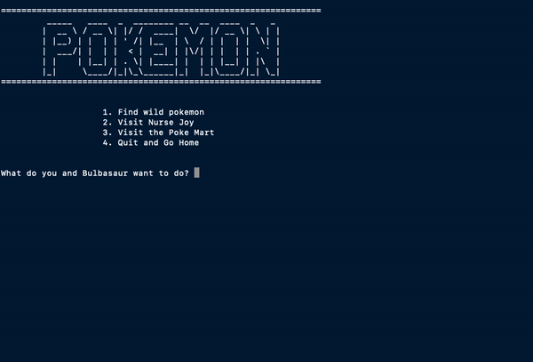
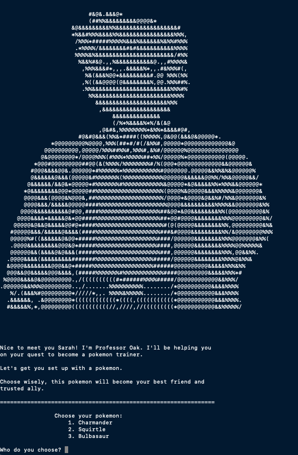

# Pokemon

This repo contains a simplified version of the classic Pokemon game. 

## Description

Take on the quest to become the world’s greatest Pokemon master! Start by selecting your starter Pokemon. This Pokemon will be your greatest ally throughout the game, so choose wisely! You and your newfound friend will travel the region looking for wild Pokemon. You may even run into the rare Mewtwo! On your way to becoming the world’s greatest Pokemon master, don’t forget to visit Nurse Joy or stop by the Poke Mart. Good luck on your journey!



## Features

* The player can battle random, wild Pokemon. During battle, the player has the option to defend, attack, or use an item. 
* The player can purchase items from the Poke Mart and use those items to help them in battle or to catch a wild Pokemon. 
* When players visit Nurse Joy, they have the option to heal their Pokemon so they can continuously battle and play the game. 
* Attacks are more or less effective based on the type of Pokemon. For example, water Pokemon will have stronger attacks against fire Pokemon. 
* The chances of catching a wild Pokemon are dependent on the type of pokeball the player uses, with the Master Pokeball having the best odds. 



## How to Use
To play the game, run the following in the command line:
``` bash
    # Clone this repository
    $ git clone https://github.com/zach-a-g/Pokemon-RPG

    # Go into the directory
    $ cd Pokemon-RPG

    # Install dependencies
    $ pip3 install -r requirements.txt

    # Run the game
    python3 Pokemon-Rpg.py

``` 

### Contributors

* [Zachary Gleeson](https://github.com/zach-a-g "Zachary Gleeson")
* [Immanuel Alexander](https://github.com/1mvnnie "Immanuel Alexander")
* [Sarah dePalo](https://github.com/sarahdepalo "Sarah dePalo")
* [Keith Benjamin](https://github.com/Islayah "Keith Benjamin")